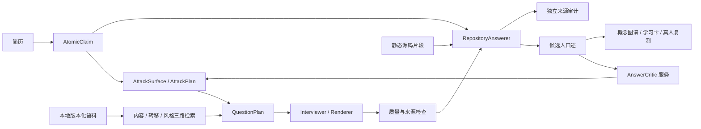

# InterviewForge

让简历决定问什么，让面经决定怎么追问，让上一轮回答决定下一问深挖哪里。

当前 **v0.3.1 / Session Schema 2.0** 提供本地面经编译库、双 Agent 对抗面试、自然口述回答、独立来源审计、知识学习卡和真人复测。可以随时导入图片和文档；每个会话固定创建时的语料版本，新导入内容用于新会话。

## 运行示例

Python 3.11+，Linux/macOS；默认不需要 API Key。

```bash
python -m venv .venv
source .venv/bin/activate
python -m pip install -e '.[dev,documents]'

# 仓库内只有自制语料，真实面经保存在自己的本地目录。
interview-forge corpus ingest examples/corpus/synthetic.json \
  --db ~/.interviewforge/corpus.sqlite3
interview-forge corpus stats

interview-forge start \
  --resume examples/redis/resume.md --repo examples/redis/repo \
  --jd examples/redis/jd.md --corpus ~/.interviewforge/corpus.sqlite3 \
  --company bytedance --role backend --round tech-2 --style corpus \
  --session sessions/redis --max-turns 6 --run

interview-forge explain-question --session sessions/redis --question q1
```

口述答案见 `sessions/redis/best_answer_cards.md`，源码、实验推演与待核实项见 `answer_audit.md`。问题来源和风格回退见 `question_provenance.json`、`interview_style_trace.md`。

`offline` 是可复现的规则基线，回答侧有 Redis、RAG、服务可靠性三组手工编写内容。通用简历理解和灵活措辞可使用 `--provider compatible --base-url http://localhost:8000/v1 --model your-model`；鉴权读取 `INTERVIEWFORGE_API_KEY`，不会写入会话。

## 随时加入图片、面经与参考文档

```bash
interview-forge corpus ingest /path/to/interviews \
  --corpus ~/.interviewforge/corpus.sqlite3
interview-forge corpus ingest /path/to/interview.png /path/to/interview.docx \
  --corpus ~/.interviewforge/corpus.sqlite3 --ocr local
interview-forge corpus inspect --company bytedance --role backend
interview-forge corpus rebuild

# 参考回答继续保存在准备资料库，供查阅、练习。
interview-forge library add /path/to/reference-answers --kind answer
interview-forge library search '压测 对照组 P99' --kind answer
```

面经输入支持 MD/TXT、JSON/JSONL，以及现有 PDF、DOCX、PNG/JPG/WebP 读取器。图片与扫描 PDF 使用 Tesseract 或配置的视觉模型；中文本地 OCR 需要 `chi_sim+eng` 语言包。DOCX 使用标准库，图片/PDF 依赖由 `.[documents]` 安装。`--ocr auto|local|vision|off`、`--ocr-language` 可控制识别方式。

编译器提取实际问题、显式回答、技术主题和已知元数据。真实问答链可以提供“回答特征 → 追问”关系；只有题目顺序的记录使用弱先验；摘要不虚构顺序、回答、公司或轮次。精确及近似重复归组，风格统计每组只计一次。

SQLite 保存不可变编译版本与 FTS5 索引。`rebuild` 从已规范化记录重建；重新读取变更的原文件请再次 `ingest`。一个导入批次整体提交，失败时不更新当前版本。**新导入不会改变已开始的会话，`reset` 也保留原版本；使用最新语料请新建会话。**

按照此次对抗面试的隔离要求，参考回答资料库用于准备阶段，RepositoryAnswerer 的运行输入限定为当前问题、简历断言、相关源码与通用技术知识。`attach-library` 只修改准备资料库位置。

## 出题与回答



一条“使用 Redis Lua 实现库存扣减，解决超卖，吞吐提升 40%”拆成实现、结果和指标三个断言。机制、测量、故障等角度单独保存在 AttackSurface。源码扫描只建立 `related` 关联，不把相关片段自动当作指标或完整断言的证明。

面试官和 AnswerCritic 看不到仓库片段、路径、证据 ID 或审计。回答器看不到面经、公司风格、攻击算子或问题计划。批评器分析上一轮口述中的缺失、含糊、矛盾和新断言；回答器自行给出的 signals 和追问建议不参与路由。其余组件都是服务，保持两个 Agent。

面经贡献抽象攻击方式：Kafka 的“为什么不直接用线程池”可以迁移为 RAG 的“为什么不直接增加 top_k”，具体 Kafka 事实不会带入问题。同公司加分低于简历相关性。公司风格来自去重后的样本统计，小样本按公司/岗位/轮次逐层回退到全局，不内置品牌性格。`--style neutral` 不启用风格先验，仍能检索适用的内容模式。

回答直接以候选人口吻说明机制、取舍与工程细节。简历与源码不完全一致时，可以合理补足设计和实验输入，例如幂等键、负载梯度、故障注入、对照组与指标。口述不插入“当前仓库没有”“证据不足”“未核实”等审计话术；推演、源码边界和实验是否执行单独记录。序列化字段为 `spoken_answer`。

## 学习与真人复测

```bash
interview-forge run --session sessions/redis --turns 2
interview-forge pause --session sessions/redis
interview-forge resume --session sessions/redis --turns 2
interview-forge tree --session sessions/redis
interview-forge retest --session sessions/redis
interview-forge answer --session sessions/redis --file my-answer.md
# 反馈失败时，原回答已经保存：
interview-forge grade-retest --session sessions/redis
```

知识图谱合并 canonical concepts，保留问题、简历和项目来源。默认学习 P0/P1、distance 0/1，`--deep-dive` 可展开 P2/distance 2。学习卡包含必知机制、边界、常见陷阱和有答案的 FollowupQA；多个相关节点通过一个综合实验覆盖，练习按单位时间收益贪心选择。

MaterialGap 说明材料不足，AnswerGap 说明本轮口述欠缺，MasteryGap 只能来自真人提交后的评估。模拟回答不提升掌握度。真人答案先落盘，再生成参考和评分；最近两次不同题目的已评估答案都通过显式人工复核才成为 `interview_ready`。评分下调、新失败或未人工复核的新评估会撤销就绪状态。

## 旧会话、评测与开发

```bash
# 旧状态不会静默加载；迁移前保存原始归档。
interview-forge migrate-session --session /path/to/old-session

interview-forge eval corpus --corpus ~/.interviewforge/corpus.sqlite3 \
  --cases evals/corpus/cases.json --output .interviewforge/eval/metrics.json

python -m pytest -q
python -m ruff check .
python -m interview_forge schemas --output schemas
python -m build
bash scripts/run_demo.sh
```

迁移保留旧问答、知识节点 ID、真人答案和复核记录；无法追溯到编译语料的历史问题明确标为 `migration`，不会补造来源。`examples/demo-output` 是保留的 Schema 1.0 迁移样本。

评测输出 JSON/Markdown，覆盖锚定率、语料引用率、重复率、追问依赖、知识和任务压缩等结构指标。语义相关性、证据事实性、风格校准等缺少人工标签的指标输出 `manual_review_required`。本地契约测试不代表真实模型质量或真实公司面试风格。

当前限制：语料规范化以规则或配置的结构化模型完成，算子归类、适用性与风格统计仍为启发式；没有嵌入索引、训练后的模式抽象器或人工校准集。每批最多 200 文件、每文件 25 MiB、JSON 每文件 500 帖；每帖 200 问、20 万字符，语义规范化每帖 3.2 万字符，超限需拆分。大语料重编译为内存批处理，近似去重最坏为平方复杂度，适合个人资料规模。详见 [当前实现与后续工作](docs/iteration-0.3.1.md)。

[CLI](references/cli.md) · [架构](docs/architecture.md) · [Schema](references/schemas.md) · [Skill](SKILL.md) · [验证](docs/validation.md) · [MIT License](LICENSE)
