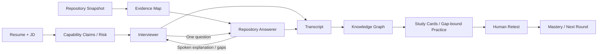

# InterviewForge

从真实简历和项目仓库出发，用技术面试追问找到知识边界，把缺口转成下一轮面试最值得完成的学习和复测任务。

**Resume → Capability Claims → Adversarial Interview → Repository-grounded Answer → Follow-up Drill → Knowledge → Practice → Human Retest**

当前 v0.2 提供 Python CLI、可加载的 [SKILL.md](SKILL.md)、双 Agent、JSON 状态与完整 Markdown 产物。不需要数据库、向量库或前端。

## Why InterviewForge

简历写着“Redis + Lua 解决超卖”，真正要守住的是：竞争条件为什么出现、原子性边界在哪里、为什么不选数据库条件更新、失败后怎么办、如何验证。

“仓库存在 Lua 文件”只是线索。能生成优秀参考答案，也不意味着候选人能独立答出来。因此本项目明确分开：

| 概念 | 意义 |
|---|---|
| Capability Claim | 能通过面试验证的能力命题，保留简历原句 |
| Repository Evidence | 带路径、行号、原文和哈希的源码观察，注明限制 |
| Answerability | 当前材料能支持多完整的回答 |
| Mastery | 用户脱离参考答案后的独立复测表现 |

模拟模式永远不提升 Mastery。缺少证据的指标、生产能力和个人职责必须标为未核实。

## Quick start

Python 3.11+，Linux/macOS；推荐使用虚拟环境。

```bash
python -m venv .venv
source .venv/bin/activate
python -m pip install -e '.[dev]'

interview-forge start \
  --resume examples/redis/resume.md \
  --repo examples/redis/repo \
  --jd examples/redis/jd.md \
  --session sessions/redis \
  --max-turns 6 --run

interview-forge tree --session sessions/redis
interview-forge report --session sessions/redis
```

默认 `offline` 无需 API Key，不发送网络请求，运行原创的 Redis/RAG/service 规则基线。它用于验证闭环和演示，不能代替通用模型的语义理解。简历和 JD 输入为 UTF-8 文本/Markdown；PDF/DOCX 需先转换。

### 接入语义模型

`LLMClient` 抽象提供 `generate` / `structured_generate`。首个适配器支持 Chat Completions 兼容的 HTTP endpoint，包括提供该接口的本地模型服务。无需供应商 SDK。

```bash
# endpoint 需要鉴权时，先设置 INTERVIEWFORGE_API_KEY 环境变量。
interview-forge start \
  --resume /path/to/resume.md --repo /path/to/project --jd /path/to/jd.md \
  --session sessions/live --provider compatible \
  --base-url http://localhost:8000/v1 --model your-model --run
```

兼容模式将简历、JD 和选取的源码片段发送到你配置的 endpoint；API Key 不写入状态文件。模型承担 Claim 提取、动态提问、技术回答、知识提取和复测评价；控制器验证结构、来源和流程。模型错误会停止当前轮，已完成的轮次可继续，不会静默变成离线答案。

接口细节、预算和所有命令见 [CLI reference](references/cli.md)。没有配置真实 endpoint 的情况下，测试仅验证本地 mock HTTP 契约，不能宣称某个真实模型已经通过质量评测。

## 双 Agent 架构



**Interviewer** 读取简历能力主张、JD、过去的口头回答和缺口信号；输入不包含仓库代码片段、路径或证据对象。问题聚焦机制、选型、落地、失败、验证和规模，而不是 grep trivia。

**Repository Answerer** 读取当前问题、Claim 和相关源码证据。证据按当前问题、Claim 关键词及能力维度排序，限制上下文预算并记录选取理由。直接回答保持简洁，完整源码在 Project Grounding 单独展示；一般知识、技术权衡、故障边界、改进方向和 Unsupported 分栏。脚本文件不能证明生产结果，测试定义不能证明测试通过。

其余组件是提取、校验、学习、持久化等服务，不是额外的自治 Agent。详细决策见 [architecture](docs/architecture.md)。

## 一次完整运行会得到什么

每轮提交后保存 authoritative `interview_state.json`。报告是可以重新生成的视图：

```text
session/
  resume.md                  jd.md
  repository_map.json        evidences.json
  claims.json                claim_risk_report.md
  interview_state.json       transcript.json / .md
  repository_evidence_map.md best_answer_cards.md
  followup_chains.md          knowledge_gap_report.md
  knowledge_graph.json       knowledge_tree.md
  study_cards.json / .md      study_plan.json
  practice_questions.md      retest_questions.md
  post_interview_review.json / .md
  next_round_plan.md          retests.json
  retest_feedback.md
```

底层 Knowledge Graph 合并共享概念，保留 Claim / Question / Project 来源；Tree View 用 `↗` 标记共享节点。默认只学习 P0/P1、distance 0/1；`--deep-dive` 可展开 P2/distance 2，P3 不进入默认计划。

任务必须绑定真实 turn/retest 的缺口，并明确要产出的测试、日志、指标或独立解释。模拟结果标 `material_gap`，真人表现标 `mastery_gap`，避免把材料缺失说成用户不会。

### Redis 示例

输入：“设计 Redis + Lua 库存扣减，解决高并发下超卖问题，声称吞吐提升 40%。”

首问聚焦原子性。缺少测量证据时转向正确性和 P99 验证；随后讨论数据库乐观锁、超时重试与竞争条件。回答可引用 `stock.lua` 中的检查和扣减原文，但把 **40% 提升、生产故障恢复和个人 Ownership 保留为未核实**。

知识从该问题生长为原子性边界、竞争条件、选型、评测和失败路径。训练要求构造并发扣减与重复请求测试，产出可运行实验；系统本身不编造实验结果。

查看 [完整 Demo](examples/README.md)，或 `bash scripts/run_demo.sh` 跑三个场景。

## 暂停、继续、复测

```bash
interview-forge pause --session sessions/redis
interview-forge resume --session sessions/redis --turns 2
interview-forge score --session sessions/redis

interview-forge retest --session sessions/redis
interview-forge answer --session sessions/redis --file my-answer.md
```

暂停适用于未完成的会话。`--turns` 控制本次新增轮数，总预算由启动时的 `--max-turns` 决定。默认每 Claim 最多五轮；连续两轮没有新增知识则换 Claim，防止无限深钻。

`retest` 先保存并展示一个问题，不展示参考答案；`answer` 先持久化真人答案，再生成反馈和参考；接口失败后可用 `grade-retest --session sessions/redis` 单独重试，无需重交答案。离线评分只是保守词面提示，模型评分也是建议。只有最近两次已评估的不同场景回答均经显式人工复核通过，节点才可成为 `interview_ready`。新的未复核评分、失败回答或下调旧评分会撤销就绪状态。完整命令见 [复测说明](references/cli.md)。

`reset` 将先前状态存入 `archives/` 并重置问答，保留输入快照；更新仓库证据请创建新会话。

## Skill 使用

向支持本地 Skill 的宿主提供本仓库的 [SKILL.md](SKILL.md)，并保留其相对路径引用的 rules、references、templates 和 Python 包。入口负责路由，具体证据与学习规则按需加载；CLI 管理可校验状态。不要只复制一个入口文件后丢失其支持资源。

## 开发与验证

```bash
python -m pytest -q
python -m ruff check .
python -m interview_forge schemas --output schemas
python -m build
```

本轮变化与验证见 [v0.2 迭代记录](docs/iteration-0.2.md)。测试覆盖 Claim/Question 质量、真实行号引用、敏感文件与 symlink 排除、知识图谱、状态恢复、复测门槛、HTTP 结构化输出修复、失败轮次回滚，以及三个完整 Golden Cases。见 [evals](evals/README.md)。CI 覆盖 Python 3.11–3.13。

```text
interview_forge/
  agents/        claims/       repository/
  interview/     knowledge/    learning/
  schemas/       storage/      cli/        prompts/
SKILL.md         rules/        references/ templates/
examples/        tests/        evals/      schemas/
```

## 限制与后续工作

- 离线基线目前聚焦 Redis、RAG、通用服务，最多处理 10 条技术陈述；Java/Go/ML 等更广泛的语义提取需要模型模式。它不是从任意源码自动重建系统的静态分析器。
- 扫描上限默认 300 文件、2 MB 总文本、单文件 128 KB。Python AST 提取符号，其他语言保留文本。未扫描内容和无匹配内容均保持未核实。
- 当前保守的材料评级上限为 `medium`；`high` 留给更强的语义/运行证据验证。不能将关键词命中或引用存在视为完整能力证明。
- 项目引用严格来自源码，生成知识仍需技术复核。正则和 JSON Schema 不能证明任意自然语言的正确性，也不能消除所有提示注入风险。
- 凭据过滤是启发式的；本地会话包含简历与代码片段，应按原材料的访问范围保存。
- 复测采用显式人工复核，没有防作弊或外部 reviewer 身份认证；它是个人学习工具。
- 持久化使用 POSIX 文件锁；Windows 原生支持、增量扫描/语义证据审核、更丰富领域包、学习间隔调度和真实模型质量基准列入后续计划。

设计与许可证研究见 [research notes](references/research-notes.md)。参考六个项目的行为与架构，未复制其源码或大段文本。项目使用 [MIT License](LICENSE)。
