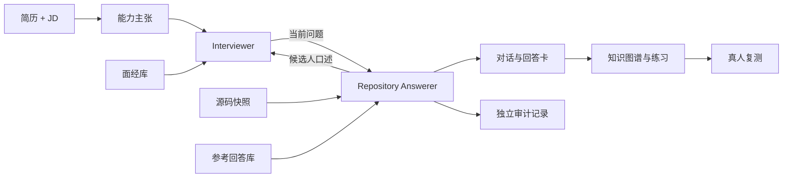

# InterviewForge

把简历、项目仓库、面经和参考回答放到一起，练习能经得起连续追问的技术面试回答。

**面经入库 → 结合简历提问 → 参考源码与回答资料 → 候选人口述 → 深挖追问 → 学习与真人复测**

当前 **v0.3** 提供 Python CLI、可加载的 [SKILL.md](SKILL.md)、双 Agent、持久化资料库和 Markdown 报告。面经可以随时追加，支持图片、PDF、DOCX 和文本；新资料在关联会话的下一轮参与检索。

## 先跑起来

Python 3.11+，Linux/macOS。默认离线运行，无需 API Key。

```bash
python -m venv .venv
source .venv/bin/activate
python -m pip install -e '.[dev,documents]'

interview-forge library add examples/materials/interview.md \
  --kind interview --tag 后端 --company 示例公司 --role 后端研发
interview-forge library add examples/materials/reference_answer.md --kind answer

interview-forge start \
  --resume examples/redis/resume.md \
  --repo examples/redis/repo \
  --jd examples/redis/jd.md \
  --session sessions/redis \
  --max-turns 6 --run

interview-forge report --session sessions/redis
```

打开 `sessions/redis/best_answer_cards.md` 看可练习的口述答案，打开 `answer_audit.md` 看源码、参考资料和推演依据。示例均为本项目自制练习材料。

`offline` 使用 Redis、RAG、通用服务的规则基线，适合本地体验完整流程。通用文档理解和更灵活的面试对话可接入语义模型。简历与 JD 仍使用 UTF-8 文本/Markdown；多格式读取用于资料库。

## 随时加入面经和参考回答

`interview` 保存面试问题、原有追问、主题和来源；`answer` 保存参考回答及其上下文。默认资料库是当前工作目录下的 `.interviewforge/library`，也可以通过 `--library` 指定自己的目录。

```bash
# 单个文件、多个文件或整个目录都可导入。
interview-forge library add /path/to/interview.png /path/to/interview.docx \
  --kind interview --tag Redis --company 示例公司 --role 后端研发
interview-forge library add /path/to/reference-answers --kind answer

interview-forge library list
interview-forge library search 'Redis 超时 幂等' --kind interview --limit 5
interview-forge library search '压测 对照组 P99' --kind answer

# 替换成 list/search 输出中的 ID。
interview-forge library show doc_ID
interview-forge library show item_ID
interview-forge library remove doc_ID
```

同一内容以同一类型重复导入会返回已有文档。资料库保留解析文本、文件哈希、页码/段落/行号和原文引用，原文件移动后仍可查看。删除文档会一起删除其索引条目；历史会话已经使用的资料保留在会话快照中。

离线提取支持 `Q:`/`A:`、中文问答标签、编号问题、Markdown 标题及显式 `追问：`。参考文档没有问答格式时，会保留标题和解释正文。复杂排版或需要语义整理时，导入命令支持模型参数：

```bash
interview-forge library add /path/to/interview.pdf \
  --kind interview --provider compatible \
  --base-url http://localhost:8000/v1 --model your-model
```

模型按批处理全文，提取的答案和追问须回指原文；长文档会产生多次请求。单文档完整提取成功后才写入资料库。目录导入逐文件提交，后续文件失败时，已经成功的文件仍保留，修正后可直接重跑。

### 图片、PDF 与 DOCX

| 输入 | 读取方式 |
|---|---|
| TXT / TEXT / MD / Markdown | UTF-8 文本 |
| DOCX | 正文段落与表格，保留段落/表格位置 |
| PDF | 优先读取文字层；没有文字的页面转为图片识别 |
| PNG / JPG / JPEG / WebP | 本地 Tesseract 或兼容模型的视觉接口识别 |

`pip install -e '.[documents]'` 安装图片/PDF 的 Python 依赖。DOCX 正文提取使用标准库；旧 `.doc` 文件请先转成 `.docx`。本地 OCR 还需要 Tesseract 及中文、英文语言包，`tesseract --list-langs` 可检查已有语言。

| 参数 | 行为 |
|---|---|
| `--ocr auto` | 默认；优先本地 OCR，失败时尝试已配置的视觉模型 |
| `--ocr local` | 使用本地 Tesseract |
| `--ocr vision` | 使用 `compatible` 模型，模型需支持图片输入 |
| `--ocr off` | 不做 OCR，仍可读取 PDF 文字层 |
| `--ocr-language chi_sim+eng` | 默认中英识别；纯英文可设为 `eng` |

下面两份图片、Word 文件也是本仓库自制演示材料，可直接复现入库：

```bash
interview-forge library add examples/materials/redis-interview.png \
  --kind interview --ocr local --ocr-language chi_sim+eng
interview-forge library add examples/materials/redis-answer.docx --kind answer

interview-forge library add /path/to/scanned.pdf \
  --kind interview --ocr vision --provider compatible \
  --base-url http://localhost:8000/v1 --model your-vision-model
```

启用虚拟环境并准备好本地 OCR 后，`bash scripts/run_material_demo.sh` 会一次完成
图片/Word 入库和六轮面试，产物写入 `sessions/material-demo/session`。

识别缺页、语言回退等情况会写入导入提示和文档记录。单文件最多 25 MiB、PDF 最多 100 页、提取文本最多 200 万字符；目录批次最多 200 个文件。

### 已有会话继续使用新资料

```bash
# 自定义资料库与新会话。
interview-forge library add examples/materials/interview.md \
  --kind interview --library /path/to/my-library
interview-forge start --resume examples/redis/resume.md --repo examples/redis/repo \
  --session sessions/with-materials --library /path/to/my-library --max-turns 8

# 把资料库接到已有会话。
interview-forge attach-library --session sessions/with-materials --library /path/to/my-library
interview-forge run --session sessions/with-materials --turns 1

# 后续任何时候入库，下一轮会重新检索。
interview-forge library add examples/materials/reference_answer.md \
  --kind answer --library /path/to/my-library
interview-forge run --session sessions/with-materials --turns 1
```

面经帮助选择主问题、改变场景并延伸追问；参考回答进入回答者上下文。问题仍围绕当前简历能力和前一轮回答。已完成的会话需要新建或 `reset` 后继续；新资料不会修改历史轮次。

## 回答像真正的面试者

回答直接讲问题、设计、选型理由、失败处理和实验方法。简历提供项目叙事，源码提供实现细节，参考资料提供论证思路。简历和代码不完全一致、实现片段缺失时，回答者会补足合理的设计与实验细节，例如幂等键、异常恢复、对照组、并发梯度和观测指标，让回答有完整逻辑。

例如，面对“Redis 扣减遇到超时重试怎么办”：

> 我会让一次业务操作始终复用同一个 request_id。脚本先查幂等结果，再检查库存，最后扣减并保存结果；超时后重试直接取回第一次的结果。验证时先设库存为 100，让 1,000 个不同请求并发争抢，再重复发送同一个请求，并在扣减完成后断开连接，检查成功数、库存和订单能否逐条对上。

口述和回答卡不插入“当前仓库没有”“证据不足”“未核实”等审计话术。源码引用、推演细节、实验方案和材料边界独立写入 `answer_audit.md/.json`：实验参数可以具体设定，推演不会被登记为已经执行的测量结果，参考文档中的他人业绩也不会成为用户的源码事实。

## 双 Agent 与来源记录



Interviewer 读取简历能力、JD、面经题目、过去的口头回答与缺口信号。其输入不包含仓库代码片段、路径、审计记录或参考答案。Repository Answerer 根据当前问题检索源码与回答材料，生成自然口述并保存依据。

提取、检索、知识图谱、报告与持久化均为服务组件，保持两个自治 Agent。详细设计见 [architecture](docs/architecture.md)。

| 概念 | 含义 |
|---|---|
| Capability Claim | 保留简历原句的能力命题 |
| Repository Evidence | 带路径、行号、原文和哈希的源码观察 |
| Material Item | 面经问题或外部参考回答，保留文档来源 |
| Answerability | 材料与回答的完整程度 |
| Mastery | 用户脱离参考答案后的独立复测表现 |

## 报告与复测

每轮提交后保存权威状态 `interview_state.json`。常用产物：

| 文件 | 用途 |
|---|---|
| `transcript.md`、`best_answer_cards.md` | 对话与可练习的口述答案 |
| `answer_audit.md/.json` | 源码依据、合理推演、实验方案与待核实项 |
| `materials.json`、`material_usage.json` | 会话资料快照与逐轮引用 |
| `repository_evidence_map.md` | 源码引用及选取范围 |
| `followup_chains.md` | 深挖追问链 |
| `knowledge_tree.md`、`study_cards.md` | 知识图谱视图和学习卡 |
| `practice_questions.md`、`next_round_plan.md` | 针对缺口的练习与下一轮安排 |
| `post_interview_review.md`、`retest_feedback.md` | 复盘与真人复测反馈 |

```bash
interview-forge pause --session sessions/with-materials
interview-forge resume --session sessions/with-materials --turns 2
interview-forge tree --session sessions/with-materials
interview-forge score --session sessions/with-materials
interview-forge retest --session sessions/with-materials
interview-forge answer --session sessions/with-materials --file my-answer.md
```

`retest` 先保存并展示一个问题，提交真人答案后才生成参考与反馈。接口失败可用 `grade-retest --session ...` 重试，真人答案已经保存。模拟回答不提升 Mastery；只有最近两次不同场景的已评分回答都通过显式人工复核，才可成为 `interview_ready`。新失败或下调评分会撤销就绪状态。

默认每 Claim 最多五轮，连续两轮没有新增知识时转向其他 Claim。默认学习 P0/P1、distance 0/1；`--deep-dive` 展开 P2/distance 2。`reset` 先归档历史并重置问答，更新仓库扫描需新建会话。

## 模型、Skill 与开发

```bash
# endpoint 需要鉴权时设置 INTERVIEWFORGE_API_KEY 环境变量。
interview-forge start --resume /path/to/resume.md --repo /path/to/project \
  --session sessions/live --provider compatible \
  --base-url http://localhost:8000/v1 --model your-model --run
```

兼容模式通过 Chat Completions 接口，把当前步骤需要的简历、源码、导入文档或图片发送到配置的 endpoint，API Key 不写入状态。模型失败会停止当前操作，已经保存的资料和轮次可继续。真实模型效果取决于所选模型；本仓库的本地契约测试不等同于真实模型质量评测。

向支持本地 Skill 的宿主提供 [SKILL.md](SKILL.md) 及其相对引用资源。所有命令见 [CLI reference](references/cli.md)，本轮设计和验证范围见 [v0.3 迭代记录](docs/iteration-0.3.md)。

```bash
python -m pytest -q
python -m ruff check .
python -m interview_forge schemas --output schemas
python -m build
bash scripts/run_demo.sh
```

源码扫描默认最多 300 个文件、2 MB 总文本、单文件 128 KB；Python 使用 AST 提取符号，其他语言保留文本。资料提取与自然语言回答仍需结合原文检查，JSON 校验不能证明语义完全正确。会话和资料库包含用户文档与源码片段，应按原材料的访问范围保存。持久化使用 POSIX 文件锁。

查看 [完整 Demo](examples/README.md)、[数据契约](references/schemas.md) 和 [研究记录](references/research-notes.md)。项目使用 [MIT License](LICENSE)。
